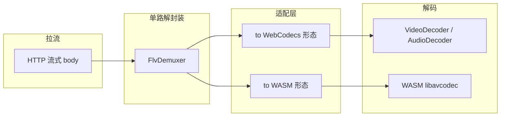
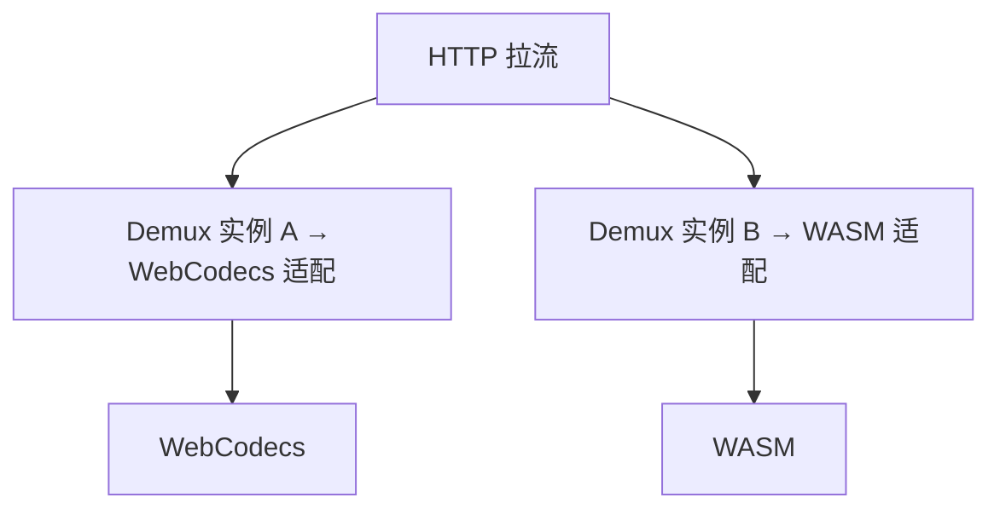

# 解封装与双解码路径架构（WebCodecs + WASM）

本文描述 **live-player** 在 **HTTP-FLV（H.264 + AAC）** 场景下的推荐架构：**一路或多路解封装** → **WebCodecs 硬解** 与 **FFmpeg WASM 软解** 两条解码后端。与方案背景对照见 [web-playback-mse-wasm-webcodecs.md](./web-playback-mse-wasm-webcodecs.md)；WASM 打包与 C 边界见 [wasm/02-emcc-glue/API.md](../wasm/02-emcc-glue/API.md)。

---

## 1. 目标

- **同一直播流**：能力允许时走 **WebCodecs**；不支持或失败时降级 **WASM/libavcodec**。
- **解封装**与**解码**职责分离：demux 只负责从 FLV 得到 **带时间戳的压缩负载** 与 **序列头**；**字节形态**在接近各解码器时再适配（见 §4）。

---

## 2. 推荐架构：单路 demux + 双适配

**默认优先**：全仓库 **只维护一套 FLV 解封装**（当前为 `packages/core` 的 `FlvDemuxer`），其输出视为 **中性语义**（序列头、压缩帧、PTS、关键帧等）。在靠近解码器处拆成两条路径：

**要点**：

- **不**要求「给 WebCodecs 的字节」与「给 WASM 的字节」相同；常见情况是 **语义一致、封装形态不同**（例如 AVCC vs Annex-B、AAC raw vs ADTS），由 **薄适配层** 转换。
- **不**在 demux 内写死某一解码器的格式；避免两条业务线改 demux。

---

## 3. 备选架构：两套各自 demux

在 **无法复用**同一套解析时（例如：一条管线要支持额外容器、或 WASM 侧坚持用 **libavformat** 吃原始 FLV 字节），允许 **两条独立 demux**：

**代价**：两套 FLV 解析需 **分别测试、对齐时间戳语义**；仅当复用成本明显高于维护成本时采用。

**本仓库当前策略**：以 **单路 `FlvDemuxer` + 双适配** 为主线；**双 demux** 记为可选演进，不作为默认实现。

---

## 4. 中性事件 vs 解码器输入（格式可不同）

| 阶段                   | 内容                                                                                                                                            |
| ---------------------- | ----------------------------------------------------------------------------------------------------------------------------------------------- |
| **Demux 输出（中性）** | 与容器相关的「已拆包」信息：如 AVC 序列头 blob、NAL 负载、AAC ASC、AAC 帧、PTS/关键帧等（具体以 `FlvDemuxEvent` 或后续抽象为准）。              |
| **→ WebCodecs**        | 转为 `codec` / `description`、`EncodedVideoChunk` / `EncodedAudioChunk` 所需形态。                                                              |
| **→ WASM**             | 转为 C API 约定的缓冲区（见 [API.md](../wasm/02-emcc-glue/API.md)），必要时在 JS 或 WASM 内做 **Annex-B / bitstream filter** 等与 FFmpeg 对齐。 |

三者不必字节级一致；**时间轴与帧边界**应对齐。

---

## 5. 能力探测与分支

1. **`VideoDecoder.isConfigSupported` / `AudioDecoder.isConfigSupported`**（或等价探测）。
2. **成功** → 走 WebCodecs 路径（单路 demux → WebCodecs 适配）。
3. **失败** → 初始化 WASM 解码（单路 demux → WASM 适配）；必要时 **仅**在此路径加载 `shell.js` / `shell.wasm`（懒加载）。

---

## 6. 相关代码与文档

| 资源                                                                                  | 说明                      |
| ------------------------------------------------------------------------------------- | ------------------------- |
| [packages/core/src/demux/flv-demux.ts](../packages/core/src/demux/flv-demux.ts)       | 当前 FLV demux 与事件类型 |
| [packages/core/src/player/live-player.ts](../packages/core/src/player/live-player.ts) | WebCodecs 编排（单路径）  |
| [wasm/02-emcc-glue/API.md](../wasm/02-emcc-glue/API.md)                               | WASM C 边界与约定         |
| [wasm/PACKAGING.md](../wasm/PACKAGING.md)                                             | 静态库与 emcc 产物构建    |
| [roadmap-webcodecs-sdk.md](./roadmap-webcodecs-sdk.md)                                | SDK 阶段路线图            |

---

## 7. 修订

| 日期       | 说明                                                                       |
| ---------- | -------------------------------------------------------------------------- |
| 2026-04-09 | 初稿：单 demux + 双适配为主，双 demux 为备选；中性事件与解码器格式可分离。 |
